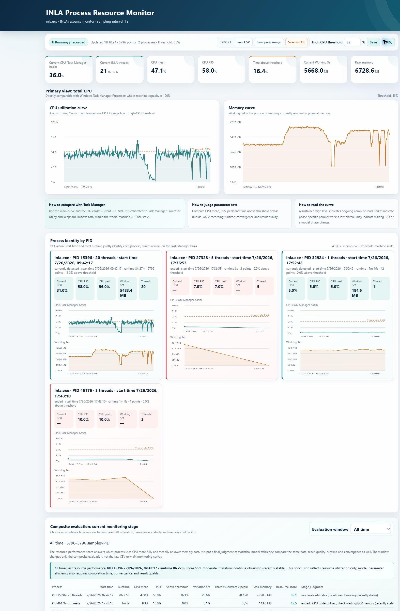
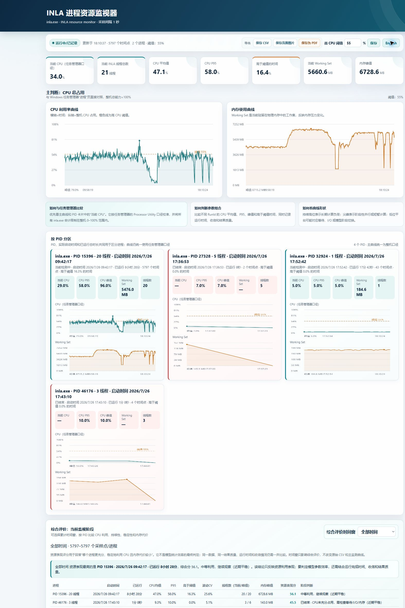

# BSTVC Monitor

Real-time INLA process monitor for Windows — find your optimal thread count and solve Bayesian latent Gaussian models faster.

[](https://www.microsoft.com/windows)
[](https://learn.microsoft.com/powershell/)
[](VERSION.md)
[](LICENSE)

## Download and run — the shortest path

**[Download this exact Windows package: `BSTVC-Monitor-v0.5.0-windows.zip`](https://github.com/bayesianstvc/BSTVC-Monitor/raw/refs/heads/main/dist/BSTVC-Monitor-v0.5.0-windows.zip)** · [Browse the source](https://github.com/bayesianstvc/BSTVC-Monitor)

After the download finishes:

1. Open your **Downloads** folder, right-click `BSTVC-Monitor-v0.5.0-windows.zip`, and choose **Extract All…**.
2. Open the extracted `BSTVC-Monitor-v0.5.0-windows` folder.
3. Double-click **`Start-BSTVC-Monitor.cmd`**. This is the correct file that starts the collector and opens the interface.
4. Wait for the browser to open `http://127.0.0.1:8765/`, then start or stop `inla.exe` whenever you need.

> **Do not double-click `dashboard.html` to start the tool.** It is the browser interface loaded by the local monitor; opening it directly cannot connect to the local API. Always start with **`Start-BSTVC-Monitor.cmd`**.

The monitor discovers new `inla.exe` instances and keeps ended runs visible. The extracted folder is portable and self-contained; keep all files together.

The portable folder is self-contained. No installer, administrator permission, internet connection, database, or cloud account is required. Keep the files together after extraction. If Windows shows a SmartScreen prompt for a downloaded script, inspect the source and choose the normal “More info → Run anyway” path only when you trust the download.

> **Important:** the product is branded **BSTVC Monitor**, while the Windows process it observes is normally `inla.exe`. You do not need to rename INLA or change your model code.

## Why this tool exists

🖥️ **INLA Process Monitor** for Windows

More threads ≠ faster inference. INLA performance on Windows often has a sweet spot — overshooting it can increase scheduling overhead, memory pressure, I/O waiting, and total solve time.

BSTVC Monitor was created for INLA-based BSTVC modelling so researchers can observe the actual resource pattern during a run and choose a thread count that fits their computer or workstation. It turns “more threads should be faster” into a measured, repeatable comparison.

The central question is not “how high can CPU usage go?” It is:

> **For the same model, data, and convergence target, which thread setting finishes reliably with the best combination of runtime, sustained compute utilization, stability, and acceptable memory cost?**

## What it monitors

- A Task Manager-oriented **whole-machine CPU curve**, scaled to 0–100% and intended for direct comparison with the Windows **Processes** page.
- **Average CPU** as the primary comparison metric, plus peak, time above a user-defined CPU threshold, and phase-specific summaries.
- Current and average **INLA thread counts** for each PID.
- Working Set memory in **GB**, per PID and for the aggregate view.
- Multiple simultaneous `inla.exe` instances, distinguished by PID, start time, runtime, and running/ended state.
- Ended processes retained in the record so a completed model is not mistaken for a missing observation.
- Automatic stage hints for warm-up, computation, I/O, low-load, and memory-risk periods, with evidence and confidence indicators.
- Time-windowed composite evaluation, model labels such as `BSTVC 20X`, hidden/excluded records, and comparison evidence.
- CPU and memory curves with hover values, synchronized time selection, child-model overlays, event markers, timeline navigation, and exportable reports.
- Advanced Windows counters when available, including logical-core diagnostics, disk read/write rate, page faults, context switches, cache size, API/render time, and health status.
- A safe recovery panel for reconnecting the page, clearing only the browser cache, starting a new run, restoring the page, and checking monitor/API health.

## Screenshots

### English interface (default)



### Chinese interface (optional)



The dashboard opens in English. Use the language button in the top toolbar to switch to Chinese. The export package and generated HTML report follow the selected interface language.

## How to compare with Windows Task Manager

Use the following order when validating a run:

1. Compare the main CPU curve and the PID card’s **Current CPU** with Task Manager’s **Processor** column at roughly the same moment.
2. Keep the same time window and remember that the two applications sample at different instants; brief differences are expected.
3. Compare **Average CPU** before peak CPU. A short spike is not evidence that a thread setting is better.
4. Then compare runtime, compute-phase CPU, average threads, Working Set in GB, stability, and whether the process entered I/O or memory-risk periods.
5. Treat the advanced single-core/logical-core counters as diagnostics. They are not the same scale as the Task Manager process percentage.

The monitor’s main `cpu_pct_total` value is deliberately capped to whole-machine 0–100% semantics. Windows counters that use a logical-core basis may exceed 100%; those values belong in **Advanced monitoring** and should not replace the primary curve.

For the metric definitions and known limitations, see [Accuracy and interpretation](docs/accuracy-and-interpretation.md).

## How to choose a thread setting

For a useful experiment, hold the model formula, data, initialization, convergence settings, and machine conditions constant. Run at least two thread configurations and preferably repeat the most promising setting.

Prioritize:

- lower completed runtime for the same model and result quality;
- higher **average CPU during the effective compute stage**, not merely warm-up or I/O;
- stable utilization rather than repeated CPU collapses;
- an acceptable Working Set and memory headroom for the target computer;
- lower scheduling and I/O symptoms when more threads are added;
- convergence, warnings, numerical quality, and downstream scientific validity.

The recommendation is decision support, not a proof of statistical-model efficiency. A high CPU percentage alone cannot establish that a model finished faster or produced a better result.

## Data and privacy

By default, run data is written to:

```text
%LOCALAPPDATA%\BSTVC-Monitor\runs\
```

Each run folder can contain:

```text
metrics.csv       complete time-series measurements
events.csv        process, phase, and lifecycle events
run.json          run metadata and configuration
summary.json      final aggregate summary
report.html       standalone readable report
live.html         fallback local snapshot
```

The dashboard keeps only a bounded recent in-memory cache for responsiveness. The complete CSV remains on disk and is not deleted by “Clear page cache” or “Reconnect monitor”. You can select another output directory at startup.

The monitor is local-only: it does not upload metrics, model data, CSV files, or screenshots. The repository contains no user run data.

## Configuration

The default sampling interval is 5 seconds. Sampling and page refresh are independent; the default page refresh is 10 seconds. The interval can be changed at startup or in the dashboard.

```powershell
# Start with the default 5-second sampling interval and a 50% CPU threshold
.\Start-BSTVC-Monitor.ps1 -IntervalSeconds 5 -HighCpuThreshold 50

# Use a custom data folder and a clear experiment label
.\Start-BSTVC-Monitor.ps1 `
  -OutputDirectory "D:\BSTVC-Monitor-Data\runs" `
  -RunId "BSTVC-20X" `
  -Label "BSTVC 20X" `
  -IntervalSeconds 5

# Start without opening a browser
.\Start-BSTVC-Monitor.ps1 -NoBrowser
```

If port 8765 is occupied, the launcher checks the next available local port and prints the actual URL. The monitor only binds to `127.0.0.1`.

## A practical workflow

1. Start BSTVC Monitor before a model run, or start it while `inla.exe` is already running.
2. Give each configuration a meaningful **custom model name**, for example `BSTVC 10X`, `BSTVC 20X`, or `BSTVC 40X`.
3. Let the run pass warm-up before judging its compute behavior.
4. Use the synchronized CPU and memory time selection to inspect the same interval.
5. Compare the composite evaluation over the same window or equal post-start duration.
6. Export the **full experiment package** after the run. It contains the selected CSV data, summaries, charts, settings, and a bilingual/selected-language HTML report.
7. Record runtime, convergence, warnings, and scientific result quality alongside the resource evidence.

## Recovery and troubleshooting

### Double-clicking appears to do nothing

Run `Start-BSTVC-Monitor.cmd` from a PowerShell window so the message remains visible. Check that the extracted folder still contains `Start-BSTVC-Monitor.ps1`, `bstvc-monitor.ps1`, and `dashboard.html`. The launcher uses a process-scoped execution-policy bypass; it does not change the machine policy.

### The page is stuck or does not discover a new process

Open **Page problem handling** and use **Reconnect monitor** first. It cancels stale page requests, clears only the browser’s in-memory chart cache, and reloads recent data without deleting CSV files. Use **Start a new monitoring run** only when you intentionally want a new run folder. Use **Restore page** as the last manual recovery action.

### No `inla.exe` appears

Confirm the process is running in Task Manager and that the monitor is pointed at the normal executable name `inla.exe`. If the process starts after the monitor, wait for the next sampling cycle. If Windows performance counters are unavailable, some advanced fields may remain blank while basic PID, CPU, memory, and thread collection continues.

### CPU does not exactly match Task Manager

Compare the main whole-machine curve with the Task Manager **Processes** view, not a logical-core counter. Align the timestamps and allow for sampling latency. Do not use the advanced counter as the primary CPU percentage.

### The browser cannot connect

Check the printed local URL, try the page’s **Reconnect monitor** action, and inspect the newest run folder. If another local service owns the port range, start with a different `-Port` value.

More details are in [Accuracy and interpretation](docs/accuracy-and-interpretation.md) and [Version history](VERSION.md).

## Requirements

- Windows 10 or Windows 11.
- Windows PowerShell 5.1 or PowerShell 7. The launcher prefers `pwsh.exe` when available.
- A current Chromium-based browser such as Google Chrome or Microsoft Edge.
- `inla.exe` from the INLA/BSTVC workflow.
- No administrator rights are required for the normal local workflow.

## Project structure

```text
dashboard.html             browser dashboard (English default, Chinese toggle)
bstvc-monitor.ps1          collector, local API, CSV writer, and report writer
Start-BSTVC-Monitor.ps1    portable launcher and health check
Start-BSTVC-Monitor.cmd    double-click Windows entry point
docs/                      metric guide, screenshots, and issue templates
dist/                      portable ZIP download
```

## Contributing

Bug reports and improvements are welcome. Please include Windows version, PowerShell version, browser, sampling interval, whether the issue affects the main Task Manager-aligned curve or an advanced counter, and a minimal reproduction. Remove model data and personal paths before attaching logs. See [CONTRIBUTING.md](CONTRIBUTING.md).

## License and acknowledgement

BSTVC Monitor is released under the [GNU Affero General Public License v3.0](LICENSE). INLA and `inla.exe` are referenced as the monitored runtime; this repository does not redistribute INLA itself. The tool is part of the broader BSTVC research and software work by the Bayesian spatiotemporal varying-coefficient modelling community.

If this monitor helps a published study, please cite the repository and describe the machine, INLA version, thread settings, monitoring window, and the model-quality checks used in the comparison.

## 中文入口

中文说明见 [README.zh-CN.md](README.zh-CN.md)。英文界面是默认设置，用户可在页面顶部一键切换中文。
